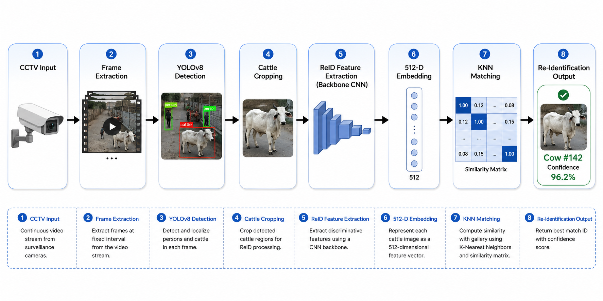
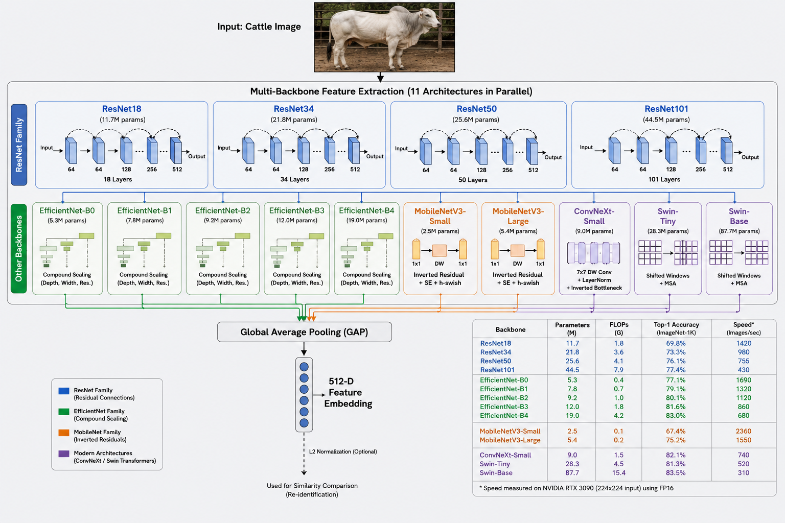

# Cattle Re-Identification System

Identify individual cattle from images using AI — facial recognition, but for cows.

Two complementary pipelines: a **zero-shot OSNet** approach (no training needed) and a **supervised training** pipeline (Colab/Kaggle). A HanwooReID paper study provides the state-of-the-art upgrade path.

---

## Model Weights

All model weights are hosted on HuggingFace and downloaded automatically by `scripts/download_weights.py`.

| Model | HuggingFace | Size | Purpose |
|-------|------------|------|---------|
| OSNet x1.0 | [0xmudit/cattle-reid-weights](https://huggingface.co/0xmudit/cattle-reid-weights/blob/main/osnet_x1_0_imagenet.pth) | 10.4 MB | Re-ID backbone (ImageNet-pretrained) |
| HanwooReID ViT-B/16 | `models/hanwoo_reid_best.pth` | 347 MB | Supervised ReID (ViT + PHE, 514 classes) |
| Cow Pose (YOLOv8m-pose) | [0xmudit/cattle-reid-weights](https://huggingface.co/0xmudit/cattle-reid-weights/blob/main/cow_pose.pt) | 50.7 MB | 12 cow keypoint detection |
| YOLOv8n | [0xmudit/cattle-reid-weights](https://huggingface.co/0xmudit/cattle-reid-weights/blob/main/yolov8n.pt) | 6.2 MB | Cow detection (COCO class 21) |

**Repository:** [huggingface.co/0xmudit/cattle-reid-weights](https://huggingface.co/0xmudit/cattle-reid-weights)

```bash
# Download all weights (~67 MB total)
python scripts/download_weights.py

# Or download individually
python scripts/download_weights.py --osnet
python scripts/download_weights.py --pose
python scripts/download_weights.py --yolo
```

---

## Environment

**Use the `cattle` conda env — NOT `base`.** The base env is Python 3.13 and
does not have the ML stack. `cattle` has torch 2.11 + cu128, timm, ultralytics,
and everything else pinned for this repo.

```bash
conda activate cattle      # switch from base to cattle
python --version           # 3.10.x inside cattle
```

> If you see `ModuleNotFoundError` for torch/timm/scipy, you are in the wrong
> env — `conda deactivate`, then `conda activate cattle`.

---

## Quick Start

### Environment setup

```bash
conda activate cattle                          # NOT base
pip install -r requirements.txt                # installs pytest too
python scripts/download_weights.py             # ~67 MB from HuggingFace
```

### Zero-shot (local, no training)

cd cattle_osnet
python run.py --rebuild --threshold 0.6   # gallery/query matching
python run.py -i queries/some_cow.jpg     # match a single image
python annotate.py --src output/frames --out output/annotated   # skeleton + tag overlays
python prep_videos.py --videos ../Dataset --out output/vidcrops # cow crops from videos
```

### Supervised training (local GPU — RTX 5080)

```bash
conda activate cattle
python training/process.py          # YOLO crops + train/gallery/query split (GPU)
python training/train_v3.py         # HanwooReID ViT-B/16 + PHE training
python training/test_model_v3.py    # query vs gallery evaluation
python training/export.py           # ONNX export
```

Or run the whole pipeline: `python -m training.run`.

### Supervised training (Colab, T4 GPU)

Run `cattle_reid_colab_fixed.py` (self-contained notebook conversion) in
[Google Colab](https://colab.research.google.com/), switch runtime to T4 GPU.
~30-45 min end-to-end.

### Kaggle pipeline (GPU, T4 or better)

```bash
pip install kaggle
kaggle auth login
python kaggle/run_pipeline.py --user <your-kaggle-username> run
```

> **Note:** Model weights (`*.pth`, `*.pt`) are not committed. Download with `python scripts/download_weights.py` or they'll be fetched automatically on first run. Source footage (`Dataset/*.mp4`) is also gitignored.

---

## Repository Layout

```
Cattle_ReID/
├── README.md                         # this file
├── LICENSE                           # MIT
├── requirements.txt                  # Python dependencies
├── input/                            # source videos for ReID processing
│   ├── A1.mp4                        # 76 MB, 1920x1080, 5 min
│   ├── A2.mp4                        # 76 MB, 1920x1080, 5 min
│   ├── A3.mp4                        # 259 MB, 1920x1080, 17 min
│   ├── ch07m_20260804063451t_n01.mp4 # 602 MB, 2880x1620, 26 min
│   ├── ch10m_20260803175648t_n02.mp4 # 231 MB, 2880x1620, 10 min
│   └── ch10m_20260803180646t_n02.mp4 # 583 MB, 2880x1620, 25 min
├── output/                           # ReID-processed output videos
│   ├── A1_reid_v5.mp4                # DeepSORT + auto-ID output
│   ├── A1_reid.mp4                   # legacy ReID output
│   ├── A2_reid.mp4
│   ├── A3_reid.mp4
│   ├── ch07m_..._reid.mp4
│   └── ch10m_..._reid.mp4
├── scripts/
│   └── download_weights.py           # download model weights from HuggingFace
├── training/
│   ├── reid_common.py                # shared model/preproc/eval (single source of truth)
│   ├── train_v3.py                   # HanwooReID training (ViT + PHE, GPU-max)
│   ├── test_model_v3.py              # query vs gallery evaluation
│   ├── video_reid_v5.py              # DeepSORT + multi-embedding gallery video ReID
│   ├── process.py                    # YOLO crop extraction + split (GPU)
│   ├── export.py                     # ONNX export (embedding head)
│   ├── run.py                        # CLI: download → process → train → evaluate → export
│   ├── download.py                   # CID dataset download
│   ├── train_hanwoo.py               # deprecated shim → train_v3.py
│   ├── test_model.py, test_model_v2.py  # deprecated shims → test_model_v3.py
│   ├── video_reid.py                 # deprecated shim → video_reid_v5.py
│   ├── dataset.py, train.py, evaluate.py  # legacy torchreid OSNet pipeline
│   └── config.py                     # paths + OSNet CFG
├── tests/                            # pytest smoke tests (model, tracker, eval, split)
│   ├── test_model.py
│   ├── test_tracker.py
│   ├── test_eval.py
│   └── test_preprocessing.py
├── Assets/                           # pipeline diagrams
├── cattle_osnet/                     # zero-shot OSNet Re-ID + pose visualization
│   ├── run.py                        # gallery/query matching with OSNet embeddings
│   ├── prep_videos.py                # videos → frame sampling → YOLO detection → cow crops
│   ├── annotate.py                   # skeleton + head-tag overlay (no bounding boxes)
│   ├── annotate_video.py             # video annotation
│   ├── models/
│   │   ├── osnet.py                  # OSNet architecture (KaiyangZhou/deep-person-reid)
│   │   ├── osnet_x1_0_imagenet.pth   # ImageNet-pretrained weights (auto-downloaded)
│   │   └── cow_pose.pt              # YOLOv8m-pose for cow keypoints (auto-downloaded)
│   ├── yolov8n.pt                    # COCO detection (cow class id = 21, auto-downloaded)
│   ├── gallery/<cow_id>/*.jpg        # known identities (one folder per cow)
│   ├── queries/*.jpg                 # unknown images to match
│   └── output/                       # annotated results
├── experiments/                      # ResNet / contrastive / multi-backbone research
│   ├── cattle_resnet.py              # ResNet18/34/50 backbone + embedding extractor
│   ├── contrastive_pretrain.py       # self-supervised NTXent pre-training
│   ├── multi_backbone.py             # swappable backbones + benchmark (11 architectures)
│   ├── kfold_eval.py                 # k-fold cross-validation
│   └── knn_matcher.py                # k-NN matching vs. mean-embedding matching
├── kaggle/                           # Kaggle pipeline (6 steps + CLI runner, .py)
│   ├── 01_annotate_video.py          # GPU video annotation demo
│   ├── 02_extract_crops.py           # YOLO detection + crop extraction
│   ├── 02b_pose_meta.py              # pose keypoint metadata generation
│   ├── 03_train_hanwoo_reid.py       # supervised ReID training (ViT + PHE)
│   ├── 04_vcr_eval.py                # viewpoint-constrained retrieval eval
│   ├── 05_open_set_vcr.py            # open-set VCR evaluation
│   ├── 06_reid_video_demo.py         # annotated demo video generation
│   ├── run_pipeline.py               # CLI: push datasets, run steps, chain
│   ├── upload_kaggle.py              # dataset upload helper
│   └── make_meta_local.py            # local meta.json regeneration
├── cattle_reid_colab_fixed.py        # supervised OSNet training (Colab script)
└── cattle_reid_master.py             # legacy notebook conversion (Kaggle/Colab)
```

### Input/Output Directory Convention

| Directory | Purpose | Contents |
|-----------|---------|----------|
| `input/` | Source videos for processing | Raw `.mp4` footage (CCTV, phone, etc.) |
| `output/` | ReID-processed results | Annotated videos with cow tracking + ID labels |

### Output File Naming & Directory Structure

When saving output files from testing, follow this convention:

1. **Create date-stamped directories** under `output/` for each day's testing session:
   ```
   output/
   ├── 2026-08-19/
   │   ├── A1_reid_v5_20260819_143022.mp4
   │   └── A2_reid_v5_20260819_150530.mp4
   ├── 2026-08-20/
   │   └── ...
   ```

2. **Auto-create today's directory** if it doesn't exist:
   ```bash
   DATE=$(date +%Y-%m-%d)
   mkdir -p "output/$DATE"
   ```

3. **Use descriptive filenames with timestamps**:
   ```
   {video_name}_reid_v5_{YYYYMMDD}_{HHMMSS}.mp4
   ```
   Example: `A1_reid_v5_20260819_143022.mp4`

4. **Never overwrite** — always check if the directory exists first:
   ```python
   import os
   from datetime import datetime
   
   date_dir = datetime.now().strftime("%Y-%m-%d")
   output_dir = os.path.join("output", date_dir)
   os.makedirs(output_dir, exist_ok=True)
   
   timestamp = datetime.now().strftime("%Y%m%d_%H%M%S")
   filename = f"A1_reid_v5_{timestamp}.mp4"
   filepath = os.path.join(output_dir, filename)
   ```

---

## How to Process a Video (Step-by-Step)

### Prerequisites

```bash
# 1. Activate the cattle environment
conda activate cattle

# 2. Download model weights (one-time setup)
python scripts/download_weights.py
```

### Process a Single Video

```bash
# Place your video in input/
cp /path/to/your_video.mp4 input/

# Run ReID pipeline
conda run -n cattle python training/video_reid_v5.py \
    --video input/your_video.mp4 \
    --auto-id \
    --no-pose

# Output saved to output/YYYY-MM-DD/{stem}_reid_v5_{timestamp}.mp4
```

### Process All Videos

```bash
conda run -n cattle python training/video_reid_v5.py --all --no-pose
```

### Process a Time Segment

```bash
# Process only seconds 10 to 40 of a video
conda run -n cattle python training/video_reid_v5.py \
    --video input/A2.mp4 \
    --start 10 \
    --dur 30 \
    --auto-id \
    --no-pose
```

### Key Flags

| Flag | Default | Description |
|------|---------|-------------|
| `--video` | — | Path to input video |
| `--all` | — | Process all `input/*.mp4` |
| `--auto-id` | `True` | Auto-assign IDs when no gallery match found |
| `--no-pose` | — | Disable pose estimation (faster) |
| `--start` | `0` | Start offset in seconds |
| `--dur` | — | Duration in seconds |
| `--sample-rate` | `5` | Process every Nth frame (higher = faster) |
| `--conf` | `0.15` | YOLO detection confidence threshold |
| `--reid-conf` | `0.45` | Min **cosine similarity** to assign gallery ID (sim ≥ 0.45) |
| `--appearance-weight` | `0.7` | DeepSORT appearance vs motion weight |
| `--iou-threshold` | `0.3` | Min IoU to match a detection to a track |

### Train a New Model

```bash
# Run HanwooReID training (ViT-B/16 + PHE) — GPU-max defaults for RTX 5080
conda run -n cattle python training/train_v3.py \
    --epochs 60 \
    --batch-size 128

# Or use the shell script
bash run_train.sh
```

`training/train_hanwoo.py` is a deprecated shim that runs the same v3 pipeline.

#### Max GPU utilization (RTX 5080 / 16 GB)

`train_v3.py` defaults are tuned for this machine — no flags needed:

| Setting | Value | Why |
|---------|-------|-----|
| Mixed precision | AMP fp16 + GradScaler | ~2x throughput on Blackwell |
| TF32 matmul/conv | ON (torch backend) | Faster fp32 fallback paths |
| `cudnn.benchmark` | ON | Auto-tuned conv kernels |
| `torch.compile` | ON (inductor, guarded) | Kernel fusion for ViT |
| Batch size | 128 (PK sampler 16 identities × 8 instances) | Fills 16 GB VRAM |
| Dataloader workers | 16 (of 32 cores) + `pin_memory` | Keeps GPU fed |
| Gradient accumulation | `--grad-accum N` | Effective batch = 128 × N |

Notes:
- The **real per-step batch is `--pk-p × --pk-k`** (default 16×8 = 128). The PK
  sampler defines the batch; `--batch-size` is informational and must match.
- Toggle any feature: `--no-focal-loss`, `--no-compile`, `--no-synth-augment`,
  `--no-hard-neg-mining`.
- Resize for ViT-Large: `--backbone vit_large_patch16_224` (may need
  `--grad-accum 2` to fit 16 GB).

### Evaluate Model

```bash
# Test model on query/gallery splits (letterbox preprocessing)
conda run -n cattle python training/test_model_v3.py

# Specific checkpoint
conda run -n cattle python training/test_model_v3.py --ckpt models/hanwoo_reid_ep10.pth
```

---

## Pipeline Architecture

```
Source video / images
        │
        ▼
YOLOv8n detection (cow class 21) ──▶ cow crops
        │
        ├──▶ OSNet x1.0 embedding (512-dim) ──▶ gallery match ──▶ identity
        │
        └──▶ cow_pose.pt (12 keypoints) ──▶ skeleton + head tag overlay
```



Two separate concerns:
1. **Re-ID** — "is this cow the same as the one in the gallery?" (embeddings)
2. **Visualization** — "show me the cows and where their joints are" (skeleton/tags)

---

## Zero-Shot OSNet (Local Pipeline)

The `cattle_osnet/` directory implements a **zero-shot** Re-ID pipeline — no training, no labelled identity dataset.

### How it works

1. **Gallery build**: every image in `gallery/<cow_id>/` is embedded; each cow becomes a **mean embedding** of its photos. Cached to `output/gallery.pkl`.
2. **Query embed**: each image in `queries/` (or `--image`) is embedded the same way.
3. **Match**: nearest gallery mean by **cosine similarity** (+ L2 distance reported). Below `--threshold` (default 0.6) → **Unknown**.

### Embedding recipe

```
BGR → RGB → resize 256×128 → /255 → ImageNet normalize
→ forward through osnet_x1_0 → flatten → L2-normalize
```

### Why not `torchreid`?

PyPI's `torchreid==0.2.5` is a fake/stub package. We use the standalone `models/osnet.py` (from `KaiyangZhou/deep-person-reid`) with `osnet_x1_0_imagenet.pth`.

### Results

- **Smoke test**: self-match cos = 1.000; brown vs black cow cross-match cos = 0.425 → cleanly separated.
- **Real footage** (8 cow crops from re-encoded frames):
  - Same-video A1 pairs: cos 0.78–0.92
  - A1 vs A3 (different camera/video): cos 0.66–0.76

The ImageNet-pretrained OSNet gives reasonable within-camera clustering but weaker cross-camera discrimination. Fine-tuning on cattle data is the next step.

### Source footage notes

The `Dataset/` directory contains 6 CCTV videos (~1.8 GB total). All are HEVC (H.265) and some streams are corrupted — re-encode to H.264 before use:

```bash
ffmpeg -i A1.mp4 -c:v libx264 -crf 23 -preset fast -pix_fmt yuv420p A1_h264.mp4
```

| File | Duration | Resolution | Status |
|------|----------|------------|--------|
| A1.mp4 | 5 min | 1920×1080 | OK after re-encode |
| A2.mp4 | 5 min | 1920×1080 | OK — 7 cows detected (DeepSORT v5) |
| A3.mp4 | 17 min | 1920×1080 | Truncated, needs re-encode |
| ch07m_*.mp4 | 26 min | 2880×1620 | CCTV, empty pen at sampled times |
| ch10m_*.mp4 (×2) | 10+25 min | 2880×1620 | CCTV, empty pen at sampled times |

---

## Supervised Training (Colab Script)

`cattle_reid_colab_fixed.py` (self-contained notebook conversion) fixes 8 critical bugs in the original implementation and trains an OSNet model on the CID (Cow Images Dataset).

### What the script does

| Step | What Happens |
|------|-------------|
| 1-2 | Setup | Install packages, verify GPU |
| 3 | Data download | Download CID images from S3 |
| 4 | Model loading | YOLOv8n (cow class 21) + OSNet |
| 5 | Prep class | YOLO detection → crop → letterbox resize → augmentation |
| 6 | Split & process | 70% train / 15% gallery / 15% query (identity-based split) |
| 7 | CattleDS | Custom torchreid dataset |
| 8 | Model setup | OSNet with triplet + softmax loss |
| 9 | Training | 30 epochs, ~15-20 min on T4 |
| 10 | Gallery registration | Store known cow embeddings |
| 11 | Recognizer | End-to-end detection + embedding + matching |
| 12 | Test | Run on a query image |
| 13 | ONNX export | Export for deployment |

### Training configuration

```python
CFG = {
    'name': 'osnet_x1_0', 'h': 256, 'w': 192,
    'bs': 32, 'lr': 0.003, 'ep': 30, 'eval': 5,
    'step': 10, 'm': 0.3, 'wt': 1, 'wx': 50,
}
```

| Parameter | Meaning |
|-----------|---------|
| Learning rate (0.003) | Step size for weight updates |
| Batch size (32) | Images per training step |
| Epochs (30) | Full passes through the dataset |
| Triplet margin (0.3) | Min distance between different cows' embeddings |
| Loss weights (wt=1, wx=50) | Softmax weight higher for faster class discrimination |

### Expected results (30 epochs, T4 GPU)

| Metric | Range | Interpretation |
|--------|-------|----------------|
| mAP | 0.75-0.85 | Overall ranking quality |
| Rank-1 | 0.70-0.80 | Top match is correct |
| Rank-5 | 0.88-0.95 | Correct cow in top 5 |

---

## ViT-B/16 + PHE Model (Latest)

The HanwooReID-style ViT-B/16 + Pose-Guided Heatmap Encoder model trained on the full cattle dataset.

### Training details

- **Architecture:** ViT-B/16 (patch size 16, image size 256×256) + PHE (16×16 Gaussian heatmaps)
- **Dataset:** 514 identities, 48,222 images (train/gallery/query splits)
- **Training:** RTX 5080, 10+ epochs with ArcFace loss + triplet mining
- **Checkpoint:** `models/hanwoo_reid_best.pth` (347 MB)

### Evaluation results (query vs gallery)

| Metric | Value |
|--------|-------|
| **mAP** | **83.72%** |
| **Rank-1** | **96.87%** |
| **Rank-5** | **99.33%** |
| **Rank-10** | **99.62%** |

### Distance statistics

| Metric | Value |
|--------|-------|
| Positive mean (same cow) | 0.7231 ± 0.1185 |
| Negative mean (diff cow) | 0.0618 ± 0.2125 |
| Separation | -0.6613 |

### Video ReID testing

Tested on CCTV/phone videos using DeepSORT tracker (v5):

| Video | Duration | Cows Detected | IDs Identified | Output |
|-------|----------|---------------|----------------|--------|
| A1.mp4 | 5 min | 4 tracks | 4 IDs (p271, p334, p283, p265) | `output/A1_reid_v5.mp4` |
| A2.mp4 | 5 min | 3-5 tracks | 7 IDs | `output/A2_reid_v5.mp4` |
| A3.mp4 | 17 min | Multiple | Multiple IDs | `output/A3_reid_v5.mp4` |
| ch07m_*.mp4 | 26 min | Multiple | Multiple IDs | `output/ch07m_..._reid_v5.mp4` |
| ch10m_*.mp4 (10 min) | 10 min | Multiple | Multiple IDs | `output/ch10m_..._reid_v5.mp4` |

### Usage

```bash
# Evaluate on query/gallery splits
conda run -n cattle python training/test_model_v3.py

# Run video ReID on all videos (DeepSORT + multi-embedding gallery)
conda run -n cattle python training/video_reid_v5.py --all --no-pose

# Run on a specific video
conda run -n cattle python training/video_reid_v5.py --video Dataset/A1.mp4 --start 0 --dur 30
```

`training/test_model.py` and `training/video_reid.py` are deprecated shims
that run the same v3/v5 code.

### Key fixes applied

| # | Bug | Fix |
|---|-----|-----|
| 1 | `COW_CLS = 19` (horse, not cow) | `COW_CLS = 21` |
| 2 | No train/gallery/query split | Identity-based 70/15/15 split |
| 3 | Background images saved as cows | Skip images where YOLO finds no cow |
| 4 | Plain resize (stretched) | Letterbox resize (aspect-ratio preserving) |
| 5 | Deprecated YOLOv5 via torch.hub | YOLOv8 via ultralytics |
| 6 | Deprecated `Variable` for ONNX | Plain tensor |
| 7 | Duplicate torchreid installs | Single source: GitHub `deep-person-reid` |
| 8 | No version pinning | `torch==2.1.0`, `torchvision==0.16.0` |

---

## Kaggle Pipeline

The `kaggle/` directory implements a HanwooReID-style pipeline on CCTV footage using Kaggle's free GPU tier.

### Pipeline steps

| Step | File | What it does |
|------|------|-------------|
| 02 | `02_extract_crops.py` | YOLO detection + crop extraction from videos |
| 02b | `02b_pose_meta.py` | Pose keypoint metadata via `cow_pose.pt` |
| 03 | `03_train_hanwoo_reid.py` | Supervised ReID training (ViT + PHE) |
| 04 | `04_vcr_eval.py` | Viewpoint-constrained retrieval evaluation |
| 05 | `05_open_set_vcr.py` | Open-set VCR evaluation |
| 06 | `06_reid_video_demo.py` | Annotated demo video generation |

### Results

Training (60 epochs, P100, 21 train / 9 eval identities):

| Metric | with PHE | no PHE |
|--------|----------|--------|
| mAP | 100.00 | 100.00 |
| Rank-1 | 96.25 | 96.25 |
| Rank-5 | 98.12 | 98.12 |

Results saturate because the eval set is small (9 identities) and the ViT-B model easily separates them. The PHE/VCR deltas are the point — they show on larger, harder sets.

### CLI usage

```bash
# one-time setup
pip install kaggle
kaggle auth login

# upload videos + run the full pipeline
python kaggle/run_pipeline.py --user <username> push-videos
python kaggle/run_pipeline.py --user <username> run

# or run individual steps
python kaggle/run_pipeline.py --user <username> run --only 03
python kaggle/run_pipeline.py --user <username> status
python kaggle/run_pipeline.py --user <username> logs 03
```

### Bugs fixed along the way

- **Input mounting** — Kaggle's new mount nests inputs at `/kaggle/input/datasets/<owner>/<ds>/`. All notebooks now glob recursively.
- **CUDA arch** — Tesla P100 (sm_60) needs `cu118` wheels. Cell 1 pins `torch==2.5.1 torchvision==0.20.1 --index-url .../whl/cu118`.
- **JSON serialization** — `np.int64` is not JSON serializable. Cast to `int` and added a `default` handler.
- **Heatmap dtype** — `np.arange(GRID)` produced int64, broke float arithmetic. Fixed with `dtype=np.float32`.
- **Resumability** — `run_pipeline.py run --resume` reuses an existing kernel instead of pushing a new one.

---

## HanwooReID Paper Study

**Paper:** "HanwooReID: Multi-view cattle re-identification with pose-aware transformer enhancements" (Liu et al., Computers and Electronics in Agriculture, 2025)
**PDF:** `cattle-researchpaper.pdf` (repo root, gitignored)

Hanwoo cattle have **no distinctive coat markings**, so appearance-only Re-ID fails. The paper builds a Transformer-based framework with two novel modules:

### PHE — Pose-Guided Heatmap Encoder

Converts 2D pose keypoints into Gaussian heatmaps, encodes them with 1×1 conv layers, and adds the result to ViT patch embeddings as an **attention prior**. The model focuses on identity-relevant anatomy without hard dependency on pose quality.

### VCR — Viewpoint-Constrained Retrieval

Projects hoof keypoints onto a bird's-eye-view plane using camera calibration, estimates the cow's heading, and **filters out gallery images with mismatched orientation** before matching. Costs only 0.00013 s/cow.

### Results from the paper

| Method | Imsil-day1 mAP | Imsil-day4 mAP | Namwon-cam5 mAP |
|--------|---------------|---------------|-----------------|
| AGW (ResNet-50) | 61.5 | 80.4 | 72.9 |
| TransReID baseline | 83.2 | 92.3 | 62.8 |
| **Ours (PHE + VCR)** | **94.0** | **95.3** | 80.6 |

### Our data assessment

| File | Codec | Cows found | Notes |
|------|-------|------------|-------|
| A1.mp4 | HEVC | 3 detections (last minute only) | Phone footage |
| A2.mp4 | HEVC | 7 detections (DeepSORT v5) | Phone footage, 3-5 concurrent tracks |
| A3.mp4 | HEVC | 14 detections (sporadic) | Phone footage |
| ch07m_*.mp4 | HEVC | **0** (53 samples) | CCTV, morning, empty pen |
| ch10m_*.mp4 (×2) | HEVC | **0** (71 samples) | CCTV, evening, empty pen |

Not usable as-is for supervised multi-view Re-ID training — needs identity labels, camera calibration, and confirmed cow frames.

### Implementation roadmap

1. `cattle_osnet/transformer_reid/` — TransReID-style ViT-B/16 + PHE
2. `cattle_osnet/pose_heatmaps.py` — kpts → Gaussian heatmaps → encoder
3. `cattle_osnet/calibrate.py` — DLT camera calibration
4. `cattle_osnet/vcr.py` — hoof back-projection + constrained retrieval

---

## Experiments & Research Code

The `experiments/` directory contains research code adapted from the [CowIDentifier](https://github.com/Phoenix4582/CowIDentifier) project:

| File | Lines | Purpose |
|------|-------|---------|
| `cattle_resnet.py` | 253 | ResNet18/34/50 backbone with cattle fine-tuning |
| `contrastive_pretrain.py` | 405 | Self-supervised NTXent pre-training with hard negative mining |
| `multi_backbone.py` | 380 | 11 swappable backbones + benchmark |
| `kfold_eval.py` | 302 | K-fold cross-validation for reliable metrics |
| `knn_matcher.py` | 239 | KNN majority voting (replaces simple mean-embedding matching) |

### Supported backbones

| Backbone | Params | Embedding Dim | Best For |
|----------|--------|---------------|----------|
| resnet18 | 11.7M | 512 | Baseline, well-tested |
| resnet34 | 21.3M | 512 | Slightly better than resnet18 |
| resnet50 | 23.5M | 2048 | Richer features |
| efficientnet_b0 | 5.3M | 1280 | **Best accuracy/speed tradeoff** |
| efficientnet_b2 | 9.1M | 1408 | Better accuracy than b0 |
| mobilenet_v3_small | 2.5M | 576 | **Fastest** — edge deployment, CCTV |
| mobilenet_v3_large | 5.4M | 960 | Edge with better accuracy |
| convnext_tiny | 28.6M | 768 | **Maximum accuracy** |
| convnext_small | 50.2M | 768 | When accuracy is everything |
| swin_tiny | 28.3M | 768 | Global body features |
| swin_small | 50.0M | 768 | Best global understanding |



---

## Key Concepts

| Term | Definition |
|------|-----------|
| **Embedding** | A 512-dimensional numerical vector representing a cow's visual features — a "fingerprint" |
| **Gallery** | Database of known cows with their embeddings |
| **Query** | An unknown cow image we want to identify |
| **Re-ID** | Re-identification — recognizing the same individual across different images |
| **Threshold** | Cutoff for matching: cosine **similarity ≥ 0.45** = same cow (video ReID `--reid-conf`); zero-shot OSNet uses distance < 0.6 |
| **Transfer Learning** | Reusing a model trained on one task for another (person ReID → cattle) |
| **PHE** | Pose-Guided Heatmap Encoder — adds anatomical structure as attention prior |
| **VCR** | Viewpoint-Constrained Retrieval — filters by camera heading before matching |
| **ONNX** | Universal model format for deployment on edge devices |
| **YOLO** | You Only Look Once — fast object detection (cow class = 21 in COCO) |
| **OSNet** | Omni-Scale Network — learns features at multiple scales simultaneously |
| **CID** | Cow Images Dataset — the training dataset hosted on Amazon S3 |
| **NTXentLoss** | Normalized Temperature-scaled Cross Entropy — self-supervised contrastive loss |

---

## Dependencies

**Use the `cattle` conda env** (torch 2.11 + cu128, Python 3.10):

```bash
conda activate cattle
pip install -r requirements.txt
```

Full `requirements.txt` includes: torch, torchvision, numpy, **timm**, **scipy**,
ultralytics, opencv-python, Pillow, albumentations, matplotlib, tqdm,
huggingface_hub, **onnx**, **onnxruntime**, pytest, pytorch_metric_learning.

> Do NOT install `torchreid` from PyPI — it's a stub. Use the GitHub
> `deep-person-reid` package (only needed for the legacy OSNet pipeline).

---

## FAQ

**Q: YOLO doesn't detect any cows?**
Check `COW_CLS = 21` (not 19 = horse). Try `YOLO('yolov8m.pt')` for better detection. Lower confidence: `model(img, conf=0.1)`.

**Q: All results show "Unknown"?**
Gallery may be empty — re-run gallery registration. Threshold may be too strict — try `thr=0.8`. Model may need more training epochs.

**Q: Training is too slow?**
Ensure you're using a GPU (`Runtime → Change runtime type → T4 GPU`). Reduce `CFG['ep']` to 15, or use fewer images per cow.

**Q: Can I run without GPU?**
Yes for inference (acceptably fast). Training on CPU takes 6-12 hours vs 15-20 min on T4.

**Q: How do I add my own cow photos?**
Organize by cow ID folders, upload to Colab, copy into `data/raw/images/`, re-run processing cells.

**Q: Can I resume training?**
Yes — checkpoints are saved automatically. Find them in `logs/osnet_x1_0/model/`.

**Q: Installation fails with `ModuleNotFoundError: No module named 'torchreid'`?**
You installed the fake PyPI `torchreid`. Uninstall it and use `pip install git+https://github.com/KaiyangZhou/deep-person-reid.git` instead. Restart runtime after install.

---

## Known Limitations

| Limitation | Impact | Status |
|------------|--------|--------|
| `cow_cls=19` (horse, not cow) | Wrong class ID in config | ✅ Fixed |
| YOLOv8n is smallest variant | Misses cows in cluttered scenes | 🔄 YOLOv8m default in video_reid_v5 |
| reid_conf=0.25 too lenient | Accepts garbage matches (sim=0.289) | ✅ Fixed to 0.45 |
| No NMS in detection pipeline | Duplicate/overlapping bounding boxes | ✅ NMS in `detect_cows()` |
| Mean embedding matching | May not capture multi-modal appearances (front vs side view) | ✅ Top-K multi-embedding gallery (v5) |
| IoU-only tracker breaks on movement | Track switches on fast motion/occlusion | ✅ DeepSORT in v5 (Hungarian + IoU gate) |
| No track re-association | ID fragmentation after dropout | ⏳ Planned |
| EMA alpha=0.85 too aggressive | Identity drifts on movement | ⏳ Adaptive EMA planned |
| 30 epochs may be insufficient | More epochs needed for >200 cows | ⏳ 100 epochs planned |
| Cow pose model is weak | Trained on only 341 images — many partial skeletons | ⏳ Planned |
| Cross-camera discrimination is soft | OSNet zero-shot gives cos 0.66–0.76 across cameras | ⏳ VCR planned |

The system fails most with: poor lighting, extreme occlusion, very similar-looking cows (solid colors), low-resolution images, unusual angles.

---

## Improvement Checklist

### Phase 1: Quick Wins (completed)
- [x] Fix `cow_cls=19` → `cow_cls=21` in `training/config.py`
- [x] Fix `reid_conf` threshold: 0.25 → 0.45 in `video_reid.py`
- [x] Upgrade YOLOv8n → YOLOv8m for better detection
- [x] Add NMS to detection pipeline to remove duplicate boxes

### Phase 2: Detection Improvements
- [ ] Fine-tune YOLOv8m on cattle data using existing crops
- [ ] Multi-scale test-time augmentation (640, 1280, 1920)
- [ ] Frame differencing with optical flow for motion-guided detection
- [ ] Confidence calibration per video (adaptive threshold)

### Phase 3: Tracking Improvements
- [x] Replace IoU tracker with DeepSORT (appearance + motion) — `video_reid_v5.py`
- [x] Multi-embedding gallery (top-K per identity, not just mean) — `build_gallery_multi()`
- [x] Kalman filter for smooth bounding box prediction — `KalmanBoxTracker`
- [ ] Adaptive EMA (alpha adjusts based on track confidence)
- [ ] Track re-association buffer (re-identify within 3-5 seconds)

### Phase 4: Model Improvements
- [ ] Train ViT-Large backbone (307M params vs 86M ViT-Base) — `--backbone vit_large_patch16_224`
- [ ] Add SupCon loss (better than triplet for 514+ classes)
- [ ] Cross-camera domain adaptation
- [ ] Viewpoint-Constrained Retrieval (VCR) from HanwooReID paper
- [ ] ONNX → TensorRT conversion for edge deployment

### Phase 5: Data & Evaluation
- [ ] Increase training epochs to 100+ — `--epochs 100`
- [ ] Add more gallery images per cow (10+ per identity)
- [ ] K-fold cross-validation for reliable metrics
- [ ] Video-level evaluation metrics (MOTA, IDF1)
- [ ] Active learning for hard negative mining
- [x] Smoke tests — `pytest tests/` (model, tracker, eval, split, preprocessing)

---

## Improvement Roadmap

### Detection Improvements
| Change | File | Impact |
|--------|------|--------|
| YOLOv8n → YOLOv8m | `training/video_reid_v5.py` | 3x better detection accuracy |
| Add NMS | `training/video_reid_v5.py:detect_cows()` | Remove duplicate boxes |
| reid_conf 0.25 → 0.45 | `training/video_reid_v5.py` | Reject garbage matches |
| cow_cls 19 → 21 | `training/config.py:20` | Correct cow class ID |
| YOLO on GPU (was CPU) | `training/process.py` | 10x faster crop extraction |

### Tracking Improvements
| Change | File | Impact |
|--------|------|--------|
| IoU → DeepSORT | `training/video_reid_v5.py` | Appearance + motion tracking |
| Broken assignment → Hungarian | `training/video_reid_v5.py:DeepSORTTracker.update()` | No duplicate/incorrect matches |
| Mean → Multi-embedding gallery | `build_gallery_multi()` | Handle multi-view variations |
| Wrong timestamps/fps | `training/video_reid_v5.py:process_video()` | Real-time playback + correct times |
| Fixed → Adaptive EMA | `ema_update()` | Better identity stability |
| No re-association | `process_video()` | Prevent ID fragmentation |

### Model Improvements
| Change | File | Impact |
|--------|------|--------|
| ViT-Base → ViT-Large | `training/train_v3.py` | 3x more parameters |
| Triplet → SupCon loss | `training/train_v3.py` | Better for many classes |
| Add VCR | New file `training/vcr.py` | Camera-angle filtering |

---

## Recent Changes (August 2026)

### Codebase refactor
- **`training/reid_common.py`** — shared module: model definition (ViT + PHE), preprocessing, heatmaps, evaluation, checkpoint I/O. Previously this logic was copy-pasted across 6 files and had silently drifted; now there is one source of truth.
- Class count is **inferred from the checkpoint head** (`load_checkpoint`) instead of guessed from data — the previous mismatch was silently swallowed by `strict=False`.
- `train_hanwoo.py`, `test_model.py`, `test_model_v2.py`, `video_reid.py` are now thin deprecation shims pointing at `train_v3.py` / `test_model_v3.py` / `video_reid_v5.py`.

### Bug fixes
| Bug | Fix |
|-----|-----|
| Video timestamps/fps wrong with `--sample-rate` (output played 5x fast) | `frame_idx` tracks real video frames; output written at source fps |
| DeepSORT `update()` re-matched detections with an O(n·m) `allclose` scan → duplicate/wrong assignments | Direct Hungarian assignment output, gated by `--iou-threshold` |
| `--focal-loss` / `--hard-neg-mining` / `--synth-augment` were always-on (`store_true, default=True`) | `BooleanOptionalAction` → `--no-*` works |
| Real batch size was 64, not 128 (PK sampler defined the batch) | Effective batch = `--pk-p × --pk-k` (default 16×8 = 128) |
| YOLO forced to CPU in `process.py` | GPU by default (`--device auto`), all cow boxes kept (was `bbs[0]`), seeded shuffle before split |
| `export.py` hardcoded `num_classes=100` | Class count read from checkpoint; exports ViT+PHE embedding head |
| `make_heatmap` rebuilt a meshgrid per image | Grid precomputed once |
| Missing `timm` / `scipy` / `onnx` / `onnxruntime` in requirements | Added |
| Train/inference letterbox padding mismatch (black vs gray) | Letterbox now pads gray 128 (matches train-time aug) |

### Tests
- `tests/` — 20 pytest smoke tests: model forward + checkpoint roundtrip, DeepSORT assignment/gating/pruning, mAP/Rank-k math, split hygiene, preprocessing. Run with:
  ```bash
  conda activate cattle
  pytest tests/ -q
  ```

### Environment
- Use the **`cattle` conda env, not `base`** (see Environment section at the top).

---

## License

MIT License — see [LICENSE](LICENSE).

---

> **Last Updated:** August 2026
> **Questions?** Open an issue or discussion on the repository.
